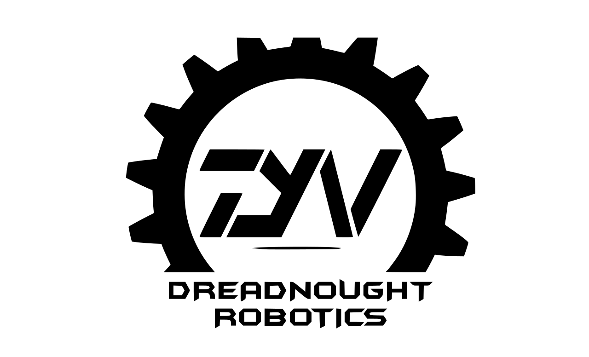

# Dreadnought Robotics — Official Team Website

> Autonomous Underwater Robotics Team · VIT Chennai


---

## Overview

Official website for **Dreadnought Robotics**, the autonomous underwater robotics team at VIT Chennai. Built with a neobrutalist black-and-white design aesthetic.

**Live site:** `https://<your-github-username>.github.io/dreadnought-robotics`

---

## Pages

| Page | Description |
|------|-------------|
| Home | Hero, achievements, about, projects preview, competitions, team preview |
| Projects | Full project grid with tech stacks and GitHub links |
| Competitions | SAUVC and TAC detailed breakdowns |
| Team | Core board, board members, and full members |
| Gallery | Filterable photo gallery |
| Sponsors | Tiered sponsor grid + sponsorship CTA |
| Contact | Social links and contact form |

---

## Tech Stack

- **Pure HTML / CSS / Vanilla JS** — zero dependencies, zero build step
- **Fonts:** Bebas Neue, Space Mono, DM Mono (Google Fonts)
- **Hosting:** GitHub Pages (free)

---

## Project Structure

```
dreadnought-robotics/
├── index.html          # Entire website (all pages, all styles, all JS)
├── README.md           # This file
├── LICENSE             # MIT License
└── assets/             # Add your images here (see below)
    ├── logo.png
    ├── team/
    │   ├── member-name.jpg
    │   └── ...
    ├── robots/
    │   ├── mira-auv.jpg
    │   └── ...
    └── gallery/
        ├── sauvc-2023.jpg
        └── ...
```

---

## Setup & Local Development

### 1. Clone the repo

```bash
git clone https://github.com/<your-username>/dreadnought-robotics.git
cd dreadnought-robotics
```

### 2. Run locally

No build tools needed. Just open `index.html` in your browser:

```bash
# Option A — open directly
open index.html

# Option B — use a simple local server (recommended)
npx serve .
# or
python3 -m http.server 8000
# then visit http://localhost:8000
```

---

## Deploy to GitHub Pages

This is the easiest way to host the website for free.

### Step 1 — Create the GitHub repo

1. Go to [github.com/new](https://github.com/new)
2. Name it `dreadnought-robotics` (or `dreadnought-robotics.github.io` for a root domain)
3. Set it to **Public**
4. Don't initialize with README (you already have one)

### Step 2 — Push your code

```bash
cd dreadnought-robotics
git init
git add .
git commit -m "initial commit: team website"
git branch -M main
git remote add origin https://github.com/<your-username>/dreadnought-robotics.git
git push -u origin main
```

### Step 3 — Enable GitHub Pages

1. Go to your repo on GitHub
2. Click **Settings** → **Pages** (left sidebar)
3. Under **Source**, select `Deploy from a branch`
4. Set branch to `main`, folder to `/ (root)`
5. Click **Save**
6. Wait ~2 minutes, then visit: `https://<your-username>.github.io/dreadnought-robotics`

---

## Adding Real Content

### Swap in team photos

In `index.html`, find the team card emoji placeholders and replace with `` tags:

```html
<!-- Before -->
<div class="team-avatar" ...>👨‍💻</div>

<!-- After -->
<div class="team-avatar" style="padding:0;overflow:hidden;">
  
</div>
```

### Swap in project images

Find `.project-img-neo` divs and add an `` inside them:

```html
<div class="project-img-neo">
  
  <!-- keep the badge and num divs below -->
</div>
```

### Update the logo box

Find `.hero-logo-block-inner` and replace the text with your actual logo SVG or image:

```html
<div class="hero-logo-block-inner">
  
</div>
```

### Add team members

Copy an existing `.team-card-page` block and update the name, role, and avatar.

---

## Customisation

All design tokens are CSS variables at the top of `index.html`:

```css
:root {
  --black: #000000;
  --white: #ffffff;
  --off-white: #f4f0e8;   /* page background */
  --paper: #ede9df;        /* alternate section background */
  --grey-mid: #888880;     /* muted text */
  --shadow: 5px 5px 0px #000;  /* neobrutalist shadow */
}
```

---

## Contributing

Team members can contribute via pull requests:

```bash
git checkout -b update/team-members
# make your changes
git commit -m "update: add new team members"
git push origin update/team-members
# open a PR on GitHub
```

---

## License

MIT — free to use and adapt for the team.

---

*Built with discipline by the Dreadnought Robotics team · VIT Chennai*
